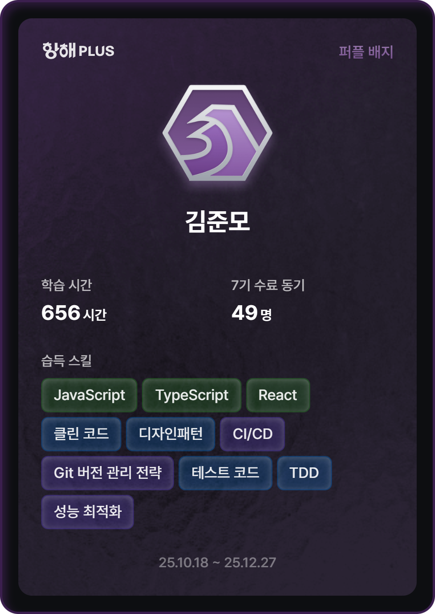

  <!-- 👋 인사 영역 (아바타 URL은 필요시 교체하세요) -->
  <!-- 아래 src 값은 GitHub 프로필 페이지에서 복사한 실제 아바타 URL로 교체해도 됩니다 -->
  

  <!-- 🖤 인트로 타이핑 배너 (도트 폰트) -->
  

## 💻 Tech Stack

<!-- 🔧 공통 프론트엔드 스택 -->

### 🌑 Frontend

  
  
  
  
  
  
  
  
  
  
  

 

### 📱 Flutter & Mobile

  
  
  

 

### 🧠 Agents, Tools & Backend-ish

  
  
  
  
  
  
  
  
  

---

 

## 📊 GitHub Stats

  <!-- 🧮 GitHub Stats 카드 -->

    

  <!-- 🐍 Contribution Snake (다크/라이트 대응, jumoooo 버전) -->
  <picture>
    <source
      media="(prefers-color-scheme: dark)"
      srcset="https://raw.githubusercontent.com/jumoooo/jumoooo/output/github-contribution-grid-snake-dark.svg"
    />
    <source
      media="(prefers-color-scheme: light)"
      srcset="https://raw.githubusercontent.com/jumoooo/jumoooo/output/github-contribution-grid-snake.svg"
    />
    
  </picture>

---

 

## 🚀 Featured Projects

<!-- 📱 Apps & UI -->

### 📱 Apps & UI

- [flutter-calender](https://github.com/jumoooo/flutter-calender)  
  플러터로 만든 캘린더 앱. 모바일 UI와 인터랙션을 실험한 작은 캘린더.  
  _(A Flutter calendar app exploring mobile UI and interactions.)_

- [bulletin_board](https://github.com/jumoooo/bulletin_board)  
  Vue 3, Firebase, Quasar로 만든 게시판 포트폴리오. 실전 CRUD 연습장.  
  _(A bulletin board portfolio built with Vue 3, Firebase, and Quasar, used as a practical CRUD playground.)_

 

<!-- 🤖 Agents & Automation -->

### 🤖 Agents & Automation

- [bmad-agent-system](https://github.com/jumoooo/bmad-agent-system)  
  항해 플러스 프론트엔드에서 사용한 BMAD Agent 커스텀. 개발 흐름을 돕는 에이전트 시스템.  
  _(A customized BMAD agent system used in the Hanghae Plus frontend to support the development workflow.)_

- [universal-notion-agent](https://github.com/jumoooo/universal-notion-agent)  
  마크다운을 자동으로 Notion에 업로드해주는 AI Agent. Cursor, Claude CLI, Antigravity 지원.  
  _(An AI agent that automatically uploads markdown content to Notion, supporting Cursor, Claude CLI, and Antigravity.)_

- [steam-game-server-mcp](https://github.com/jumoooo/steam-game-server-mcp)  
  Steam 게임 서버 정보를 조회·모니터링하고 게임 서버를 관리하는 MCP 서버.  
  _(An AI-powered MCP server for querying, monitoring, and managing Steam game servers.)_

 

<!-- 🛠️ Setup & Utilities -->

### 🛠️ Setup & Utilities

- [my-cursor-setup](https://github.com/jumoooo/my-cursor-setup)  
  Cursor 개발 환경을 위한 셋업 리포. 내가 쓰는 도구와 설정 모음집.  
  _(A setup repository for my Cursor development environment, collecting the tools and configurations I use.)_

<!-- 👉 여기에 더 보여주고 싶은 레포가 생기면 섹션을 추가하거나 항목을 확장하면 됩니다 -->

---

 

## 📝 Blog & Links

<!-- ✏️ Velog 블로그 -->

---

 

## 🕯️ Achievements & Artifacts

- 🏅 Bootcamp / Program
  - 항해 PLUS 수료 뱃지  
     
    

---
